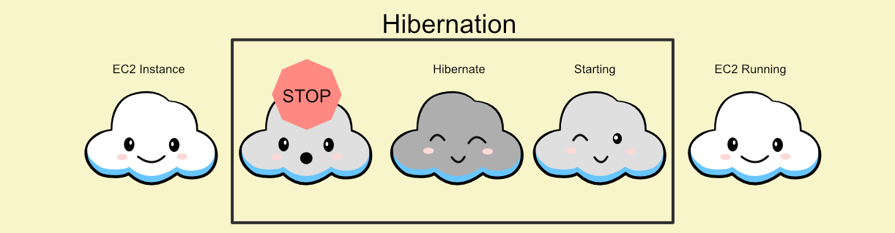

[Amazon Elastic Compute Cloud (Amazon EC2)](https://aws.amazon.com/ec2/) is a web service that provides secure, resizable compute capacity in the cloud.

It is designed to make web-scale computing easier for developers.

### What is EC2 Hibernation?

Have you ever put your computer to "sleep"?
When you close the computer your work is still saved and available as soon as you open the computer back up.

In the same way we can put our EC2 instances "to sleep" or hibernation.

### Hibernation Flow:

    

        <figure>
            
        </figure>
    

### Benefits

**[Hibernation](https://docs.aws.amazon.com/AWSEC2/latest/UserGuide/Hibernate.html)** saves the contents from the instance memory (RAM) to your [Amazon EBS](https://aws.amazon.com/ebs/?ebs-whats-new.sort-by=item.additionalFields.postDateTime&ebs-whats-new.sort-order=desc) root volume.

This leads to a **faster** boot up time for your instances.

AWS persists the instance's Amazon EBS root volume and any attached Amazon EBS data volumes.

####When an instances is started again:

- Your Amazon EBS volume is restored to it's previous state. (_Like when opening a computer that has been "put to sleep"_)
- Your **RAM contents** are reloaded and **the processes** that previously were running on the instance are **resumed.**

### Important Information

EC2 hibernation is available for [On-Demand](https://docs.aws.amazon.com/AWSEC2/latest/UserGuide/ec2-on-demand-instances.html) and [Reserved](https://aws.amazon.com/ec2/pricing/reserved-instances/) Instances.

An Instance can only be put in to hibernation if it meets the [hibernation prerequisites.](https://docs.aws.amazon.com/AWSEC2/latest/UserGuide/Hibernate.html#hibernating-prerequisites)

####Examples of prerequisites include:

- The root **EBS** volume must be **encrypted**.
- Supported instance families include: C3, C4, C5, M3, M4, M5, R3, R4, and R5
- Instance RAM size must be less than 150 GB
- The Amazon Machine Images it currently supports are Amazon Linux 2, Linux AMI, Ubuntu and Windows

AWS does not charge for a hibernated instance when it is in a **stopped** state.

There are limitation and actions not supported for hibernation.

For a complete list of limitations check out the [AWS documentation.](https://docs.aws.amazon.com/AWSEC2/latest/UserGuide/Hibernate.html#hibernating-not-supported)

####Use Cases for Hibernation:

- Apps with long-running processing
- To save RAM state for quicker boot-up
- For services that take a lot of time to initialize

This topic is addressed in the new [AWS Solutions Architect Exam](https://aws.amazon.com/certification/coming-soon/)**[SAA-C02]**

If you want to learn even more and prepare for the AWS Certified Solutions Architect Associate Exam then check out our course on [ExamPro.](https://www.exampro.co/aws-exam-solutions-architect-associate)
